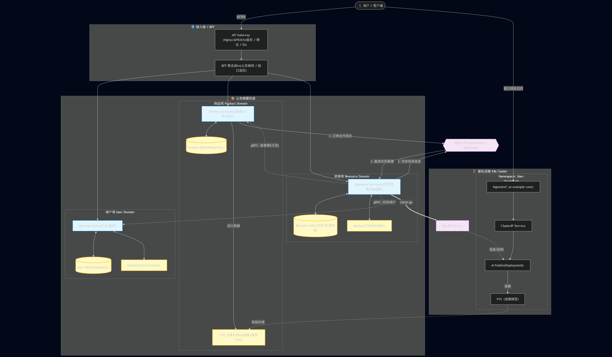

# 系统架构


# 领域说明
## User Domain
### 用户域负责：

**账号注册 / 登录**

1. 创建新用户账号

2. 用户名 / 邮箱唯一性校验

3. 密码校验

4. 明文密码 → Hash 后存储

5. 登录时比对密码

**Token（JWT）签发**

为已验证身份的用户签发 JWT，包含基础 Claims：user_id、roles、exp 等

**用户状态管理**

1. 启用 / 禁用账号 _(被禁用的用户无法登录 / 创建订单)_

2. 权限（Role）信息提供（如需要）

3. 普通用户 / 管理员等角色

4. 提供角色信息给 BFF 或其他服务做权限控制

### 聚合根

用户是唯一聚合根，因为用户域内所有模型都依附于用户。

| 字段           | 类型       | 说明                             |
| ------------ | -------- | ------------------------------ |
| ID           | uuid      | 用户唯一标识（主键，自增或雪花）               |
| Email        | string   | 登录账号，需唯一                       |
| PasswordHash | string   | 加密后的密码（如 bcrypt）               |
| Nickname     | string   | 用户昵称                           |
| Status       | enum     | 用户状态：启用/禁用/封控中                     |
| Roles    | []string | 角色列表，例如：`["user"]`、`["admin"]` |
| CreatedAt    | time     | 创建时间                           |
| UpdatedAt    | time     | 更新时间                           |  
  
## Resource Domain  

### 资源域负责

1. **实例生命周期管理（创建 / 启停 / 删除）**

    1. 创建实例（Create Instance）
    2. 启停 / 重启实例（Start / Stop / Restart）
    3. 删除实例（Delete Instance）

2. **K8s 的交互与状态同步**

    1. 下发资源（Apply K8s Resources）
    2. 状态同步（Sync Status）

3. **域名 / 访问入口管理**

    1. 域名生成
    2. 消息转发

### 聚合根
Instance（用户实例） 是唯一聚合根，其他模型（规格 / 状态 / K8s 绑定信息）都附着于它。

| 字段                                | 类型     | 说明                               |
| --------------------------------- | ------ | -------------------------------- |
| InstanceID                        | int64  | 雪花变体主键 [UserID:16][Ex:4][TS:41][Seq:3] |
| UserID                            | int    | 用户 ID                            |
| Name                              | string | 实例名称                             |
| Status                            | enum   | 核心状态机字段                          |
| CreatedAt / UpdatedAt / DeletedAt | time   | 生命周期字段                           |

### 子实体

1. InstanceSpec（规格实体）

| 字段         | 类型     | 说明    |
| ---------- | ------ | ----- |
| InstanceID | int64  | 对应聚合根 |
| CPU        | int    | 核心数   |
| Memory     | int    | 内存    |
| GPU        | int    | 可为null, int 代表不同类型  |
| Image      | string | 镜像    |
| ConfigJSON | json   | 扩展配置  |

2. InstanceK8s（运行态实体，高频更新，保存redis最近一次的快照）

| 字段             | 类型     | 说明             |
| -------------- | ------ | -------------- |
| InstanceID     | int64  | 聚合根            |
| Namespace      | string | NS             |
| DeploymentName | string | K8s Deployment |
| ServiceName    | string | K8s Service    |
| IngressName    | string | K8s Ingress    |
| LastK8sState   | string | Pod Phase      |
| LastK8sMessage | string | 错误信息           |
| ErrorReason    | string | 最新错误原因         |
| UpdatedAt      | time   | 最新活动时间         |

3. InstanceNetwork（用户私有入口相关）

| 字段          | 类型     |
| ----------- | ------ |
| InstanceID  | int64  |
| EndpointURL | string |
| Domain      | string |
| Port        | int    |
| CreatedAt   | time   |
| UpdatedAt   | time   |

4. InstanceLogs（领域日志表）

| 字段         | 说明                                         |
| ---------- | ------------------------------------------ |
| ID         | 自增主键                                       |
| InstanceID | 关联实例                                       |
| LogType    | 日志类型：INFO / ERROR / WARNING / STATE_CHANGE |
| Message    | 日志内容（文本）                                   |
| DataJSON   | 可选（结构化信息）                                  |
| CreatedAt  | 日志时间                                       |

### Redis缓存模型状态

**字段说明**

| 字段             | 说明                                            |
| -------------- | --------------------------------------------- |
| state          | 资源域用状态（Running / Failed / Creating）           |
| phase          | Pod Phase（Running / Error / CrashLoopBackOff） |
| ready_replicas | Pod 就绪数                                       |
| total_replicas | Deployment 副本数                                |
| pod_name       | 当前对应 Pod                                      |
| message        | 最近一次事件消息                                      |
| error_reason   | K8s 错误原因                                      |
| updated_at     | 更新时间戳（秒级）                                     |

``` redis
HSET instance:k8s:{instance_id} \
    state "Running" \
    phase "Running" \
    ready_replicas "1" \
    total_replicas "1" \
    pod_name "llm-7846fdfb7f-k82xn" \
    message "Container started successfully" \
    error_reason "" \
    updated_at "1739504500"
```

### 消息队列

1. 实例事件 (instance.events)

```json
{
  "event_type": "INSTANCE_CREATED",
  "instance_id": 912345678901,
  "timestamp": 1739525000,
  "user_id": 88,
  "name": "my-llm-instance",
  "data": {
    "cpu": 2,
    "memory": 4096,
    "gpu": 0,
    "image": "registry.xxx/llm:v1"
  }
}
```

事件信息
| 行为                     | 事件类型                     |
| ---------------------- | ------------------------ |
| 创建实例                   | INSTANCE_CREATED         |
| 删除实例                   | INSTANCE_DELETED         |
| 规格变更（CPU/Memory/Image） | INSTANCE_SPEC_CHANGED    |
| 镜像删除                   | INSTANCE_IMAGE_REMOVED   |
| 镜像更新                   | INSTANCE_IMAGE_UPDATED   |
| 启动实例                   | INSTANCE_STARTED         |
| 停止实例                   | INSTANCE_STOPPED         |
| 实例状态变化（Running/Failed） | INSTANCE_STATUS_CHANGED  |
| K8s 状态回传               | INSTANCE_K8S_SYNC        |
| 域名/网络更新                | INSTANCE_NETWORK_UPDATED |


## Product Domain

### 商品域负责

负责整个业务链路中“可售卖内容”与“交易行为”的核心逻辑

### 聚合根（Product Aggregate）

| 字段          | 类型          | 说明                                              |
| ----------- | ----------- | ----------------------------------------------- |
| ProductID   | int64       | 主键（雪花ID），适配高并发下的分布式ID                          |
| Name        | string      | 套餐名称，例如："基础型实例"、"深度学习专用型"                   |
| Description | string      | 详细描述                                            |
| Status      | enum        | ENABLED / DISABLED，控制是否可见/可售                   |
| Price       | int64       | 单价（分），避免金额计算精度丢失                                |
| SpecID        | int64       | 规格值对象（Value Object），一旦创建不可修改，若规格变动应发布新商品       |
| CreatedAt   | time        | 创建时间                                            |
| UpdatedAt   | time        | 更新时间                                            |

### 子实体

ProductSpec（值对象 Value Object，一经创建不可删除）

| 字段         | 类型     | 说明                             |
| ---------- | ------ | ------------------------------ |
| SpecID     | int64  | 自增主键                      |
| CPU        | int    | 单位：核 (Core)                   |
| Memory     | int    | 单位：GB                         |
| GPU        | int    | 型号/核心数（可为空）                   |
| Image      | string | 镜像 ID 或名称                     |
| ConfigJSON | json   | 扩展配置（如磁盘类型、带宽等）               |

Order 订单信息
| 字段          | 类型    | 说明                                       |
| ----------- | ----- | ---------------------------------------- |
| OrderID     | int64 | 订单主键（雪花ID）                               |
| UserID      | uuid  | 用户 ID                                    |
| ProductID   | int64 | 商品 ID                                    |
| ReqID       | int64 | Redis 生成的请求号（用于幂等/判重），与 ProductID 组成唯一索引 |
| Amount      | int64 | 订单金额（分）                                  |
| InstanceID  | int64 | 资源实例 ID（可为空），资源创建成功后填充                   |
| Status      | enum  | PENDING / PAID / CANCELLED / COMPLETED   |
| CreatedAt   | time  | 下单时间                                     |
| PaidAt      | time  | 支付时间（可为空）                                |
| CompletedAt | time  | 交付/完成时间（可为空）                             |
